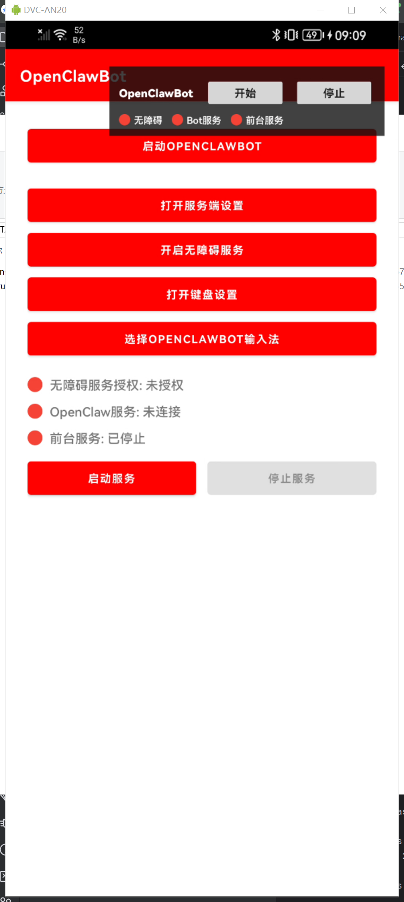
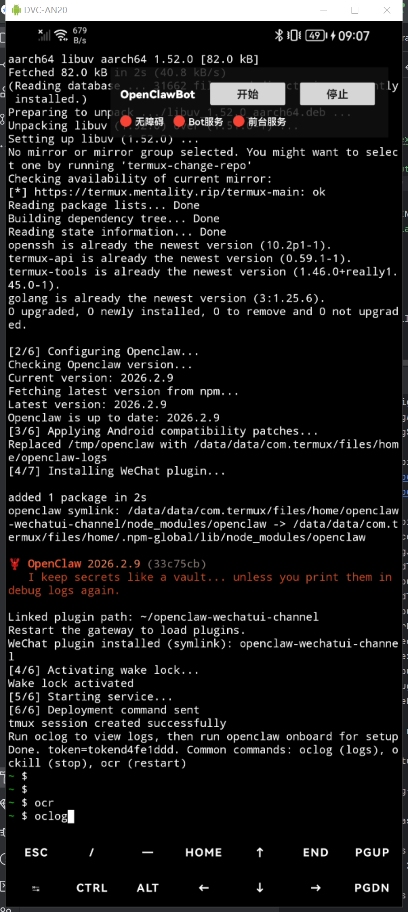
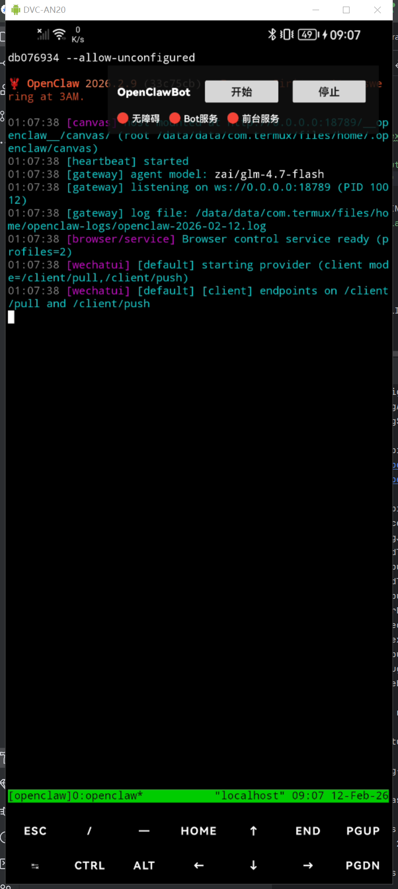
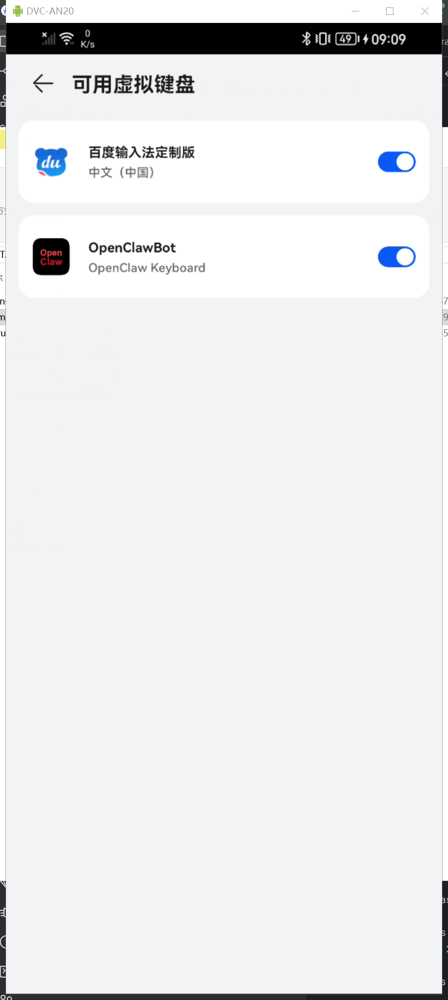
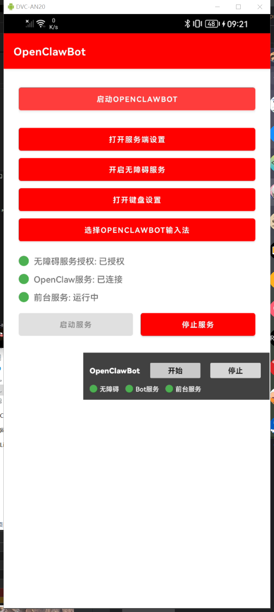
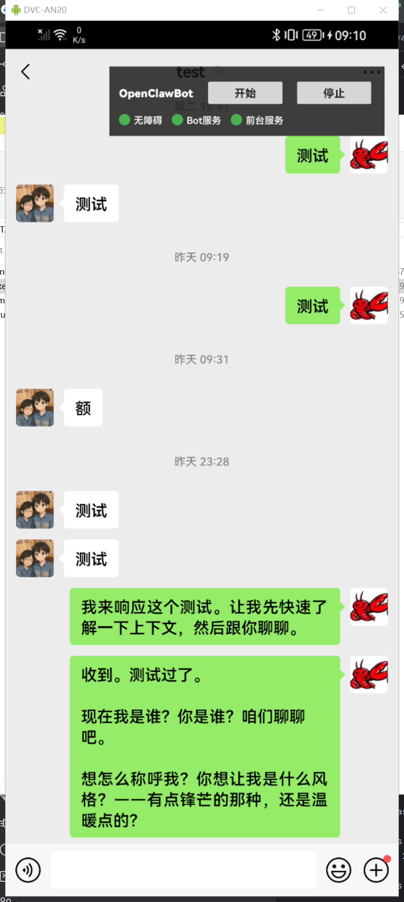

[](https://github.com/chentyjpm/openclaw-android-wechat/actions/workflows/debug_build.yml)

# OpenClawBot Android

## 项目简介

OpenClawBot Android 是一个基于 Termux 的移动端自动化方案，目标是在 Android 真机上运行 OpenClaw，并通过无障碍服务与输入法实现可控交互能力。

核心能力：

- 在 Android 设备内通过 **Termux** 运行 **OpenClaw** 服务
- 通过 **无障碍服务** 获取界面结构、控件信息和页面变化
- 通过 **输入法服务（IME）** 执行输入、切换焦点、发送等动作
- 通过前台服务与悬浮窗展示运行状态并提供操作入口

## 工作流程

1. App 启动后准备运行环境，并把启动脚本与插件资源同步到 Termux 目录。
2. 在 Termux 中启动 OpenClaw 主进程并加载插件。
3. 无障碍服务持续采集 UI 状态，输入法服务负责执行交互动作。
4. 前台服务维持进程常驻，降低系统回收导致的中断风险。

## 核心模块

- `app/`：Android 主应用、页面入口、资源打包。
- `wx-server/`：无障碍能力、任务桥接、状态上报。
- `app/src/main/res/raw/startup_openclaw.sh`：Termux 初始化与启动脚本。

## 环境准备

- Android 真机（建议长期供电，关闭省电限制）
- 已安装 Termux
- 网络可用（用于安装依赖和访问模型/API）
- 已准备 OpenClaw 所需 API 配置（可后置到 `openclaw onboard`）

## 安装和使用



### 1. 启动安装

点击首页第一个按钮，启动 OpenClawBot 初始化安装。



### 2. 初始化 OpenClaw

安装完成后，在 Termux 执行：

```bash
openclaw onboard
```

根据提示配置 LLM API。当前方案可先不额外配置 channel，默认插件可先与 App 联动。

### 3. 启动与检查

执行以下命令完成启动与检查：

```bash
ocr
oclog
```

- `ocr`：重启相关服务链路
- `oclog`：查看日志，确认 OpenClaw 是否正常运行



### 4. 授权系统权限

依次完成：

- 开启无障碍服务权限
- 启用 OpenClawBot 输入法
- 将当前输入法切换为 OpenClawBot



### 5. 结果示意



### 6. 启动服务并开始交互

启动前台服务，确认状态正常后，切换到目标聊天界面，点击开始按钮即可进入交互流程。




## 方案优势

- 真机独立运行，具备较强物理隔离能力。
- 可对接国内平台与 API，便于本地化部署。
- 基于无障碍 + IME 的交互能力，适合移动端自动化场景。

## 风险与合规

- 本项目依赖系统级权限（无障碍、输入法、前台服务）。
- 聊天软件自动化（尤其微信）存在账号与合规风险，请仅在合法、可控场景中使用，并自行承担相关责任。

## TODO

- 支持调取更多手机硬件能力
- 支持调用摄像头拍照

## 参考项目与致谢

- https://github.com/termux/termux-app
- https://github.com/hillerliao/install-openclaw-on-termux
- https://github.com/Tencent/ncnn
- https://github.com/nihui/ncnn-android-ppocrv5

